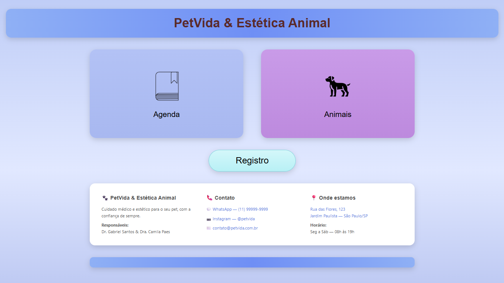
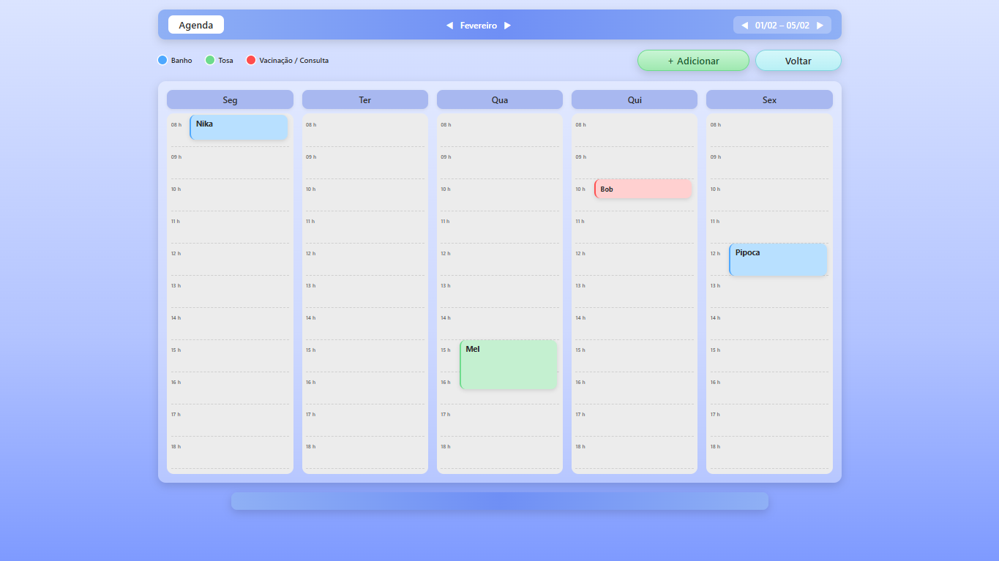
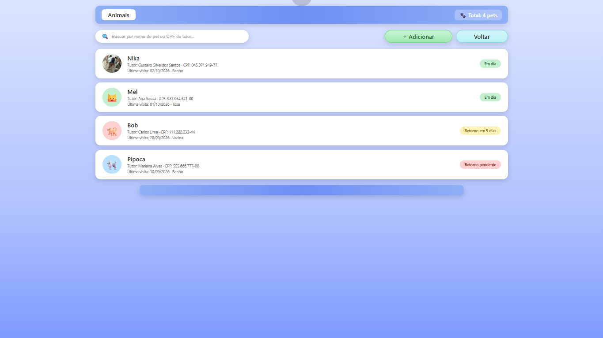
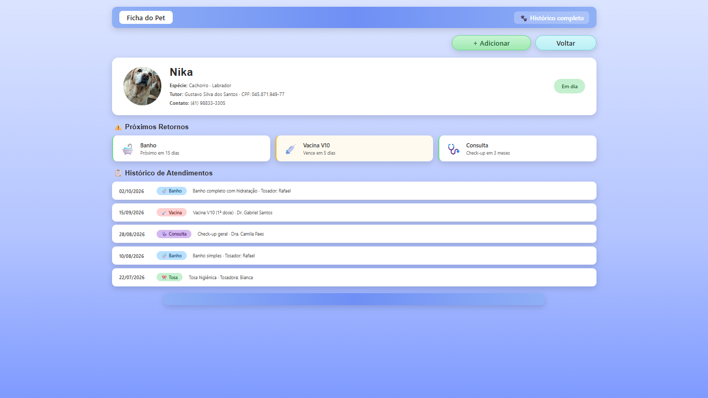
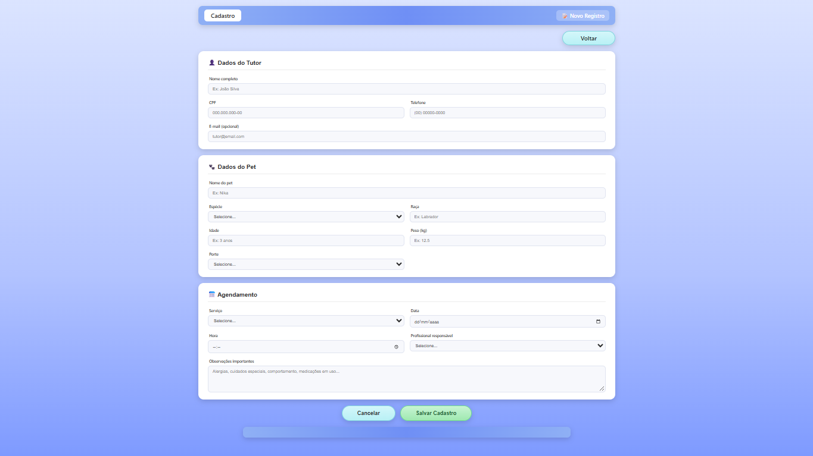

# 🐾 PetVida & Estética Animal

Sistema web de agendamento e gestão de histórico de pets para a clínica veterinária **PetVida & Estética Animal**.

> Projeto desenvolvido como atividade avaliativa da disciplina de **Design Profissional — Produção de Portfólio & Desenvolvimento Empresarial**.

---

## 📌 Sumário

- [Sobre o projeto](#-sobre-o-projeto)
- [O problema](#-o-problema)
- [A solução](#-a-solução)
- [Funcionalidades](#-funcionalidades)
- [Telas do sistema](#-telas-do-sistema)
- [Estrutura do projeto](#-estrutura-do-projeto)
- [Como executar](#-como-executar)
- [Tecnologias utilizadas](#-tecnologias-utilizadas)
- [Autor](#-autor)
- [Licença](#-licença)

---

## 📖 Sobre o projeto

A **PetVida** é uma clínica veterinária e centro de estética pet de bairro fundada pelo **Dr. Gabriel Santos** e pela **Dra. Camila Paes**. O espaço oferece consultas médicas, vacinação, cirurgias de pequeno porte, além de serviços de banho e tosa.

Este projeto consiste em um **protótipo web estático** (HTML + CSS) que simula um sistema interno de agendamento, cadastro de pets e consulta de histórico — substituindo o controle manual em agenda de papel e pastas físicas.

---

## ⚠️ O problema

Com o crescimento da clínica, o gerenciamento manual começou a apresentar falhas:

- **Choque de horários** entre banhos e consultas
- **Tutores esquecem** a data de retorno do banho ou da vacina do pet, gerando lacunas na agenda
- **Recepção perde tempo** procurando históricos médicos em pastas físicas de arquivo morto
- **Perda de receita** por horários ociosos e falta de lembretes automáticos

Se a clínica mantivesse o gerenciamento manual, a insatisfação dos tutores aumentaria e a receita continuaria caindo.

---

## 💡 A solução

Foi desenvolvido um **web app estático** (HTML + CSS) com as seguintes decisões de design:

### Por que **site/web app** e não aplicativo mobile?

- A recepção usa **desktop** como ferramenta principal de trabalho
- Acesso via navegador **sem instalação** — adoção imediata pela equipe
- Um único sistema centraliza **agenda + histórico**, resolvendo as duas dores de uma vez
- O escopo da entrega é um **protótipo visual navegável**, alinhado ao domínio técnico do autor

### Estrutura das telas

O sistema foi dividido em **5 páginas** que se comunicam:

| Tela | Função |
|---|---|
| **Painel** | Menu principal com acesso à Agenda, Animais e Registro |
| **Agenda** | Grade semanal com horários e agendamentos por dia |
| **Animais** | Lista de pets com busca por nome/CPF e status de retorno |
| **Ficha do Pet** | Histórico completo de atendimentos + próximos retornos |
| **Cadastro** | Formulário de novo agendamento (tutor, pet, serviço, data/hora) |

---

## ✨ Funcionalidades

### 🏠 Painel principal (`index.html`)
- Acesso rápido aos módulos **Agenda** e **Animais**
- Botão **Registro** para novo cadastro
- Rodapé com contatos, endereço e informações da clínica

### 📅 Agenda (`agenda.html`)
- Grade semanal de **Segunda a Sexta**
- Horários das **08h às 18h**
- Blocos coloridos por tipo de serviço:
  - 🔵 **Banho** — azul
  - 🟢 **Tosa** — verde
  - 🔴 **Vacinação/Consulta** — vermelho
- Altura dos blocos proporcional à duração do serviço
- Navegação visual entre meses e semanas

### 🐾 Animais (`pets.html`)
- Lista de pets cadastrados com foto (avatar), tutor e CPF
- **Status visual** de retorno:
  - 🟢 **Em dia**
  - 🟡 **Retorno em X dias**
  - 🔴 **Retorno pendente**
- Barra de busca (por nome do pet ou CPF do tutor)

### 📋 Ficha do Pet (`pet-detalhe.html`)
- Cabeçalho com dados do pet e do tutor
- **Próximos retornos** (banho, vacina, consulta) com alerta visual
- **Histórico completo** de atendimentos, com data, tipo e detalhes

### 📝 Cadastro (`cadastro.html`)
- Formulário dividido em 3 seções:
  - **Tutor:** nome, CPF, telefone, e-mail
  - **Pet:** nome, espécie, raça, idade, peso, porte
  - **Agendamento:** serviço, data, hora, profissional, observações
- Validação nativa do navegador (`required`, `type="date"`, `type="number"`)

---

## 🖼️ Telas do sistema

### Painel principal


### Agenda semanal


### Lista de animais


### Ficha do pet


### Cadastro


---

## 📁 Estrutura do projeto

```
petvida-clinica/
├── assets/
│ ├── Agenda.png
│ ├── Cachorro.png
│ └── Nika.jpg
├── css/
│ └── style.css
├── index.html
├── agenda.html
├── pets.html
├── pet-detalhe.html
├── cadastro.html
├── README.md
└── LICENSE
```

---

## 🚀 Como executar

Como o projeto é **100% estático** (apenas HTML e CSS), não há necessidade de instalação ou servidor.

### Opção 1 — Abrir direto no navegador

1. Faça o download ou clone o repositório:
   ```bash
   git clone https://github.com/GustavoSS33/petvida-clinica.git
    ```

2. Navegue até a pasta do projeto
    Dê duplo clique no arquivo index.html

### Opção 2 — VS Code + Live Server (recomendado)
1. Abra a pasta no VS Code
2. Instale a extensão Live Server
3. Clique com o botão direito em index.html → Open with Live Server

---

## 🛠️ Tecnologias utilizadas

| Tecnologia | Uso |
|---|---|
| **HTML5** | Estrutura semântica das 5 páginas |
| **CSS3** | Estilização, layout (Flexbox + Grid), responsividade e gradientes |
| **SVG inline** | Ícones dos cards do painel |
| **Google Fonts (Poppins)** | Tipografia moderna |

### O que **não** foi usado (e por quê)

- **JavaScript:** o projeto é um **protótipo visual estático** — não há persistência de dados
- **Backend/SQL:** fora do escopo da disciplina

### Próximos passos (roadmap)

- [ ] Adicionar **JavaScript** para interatividade real (filtros, navegação de mês, modais)
- [ ] Implementar **backend** (Node.js + banco de dados) para persistência
- [ ] Criar **versão mobile** (PWA ou app nativo) para o tutor agendar direto
- [ ] Adicionar **notificações automáticas** de retorno via WhatsApp/e-mail

---

## 👨‍💻 Autor

**Gustavo Silva dos Santos**

- GitHub: [@GustavoSS33](https://github.com/GustavoSS33)

---

## 📄 Licença

Este projeto está licenciado sob a **MIT License** — veja o arquivo [LICENSE](./LICENSE) para mais detalhes.

---

<p align="center">
  Desenvolvido com 🐾 para a disciplina de Design Profissional
</p>

